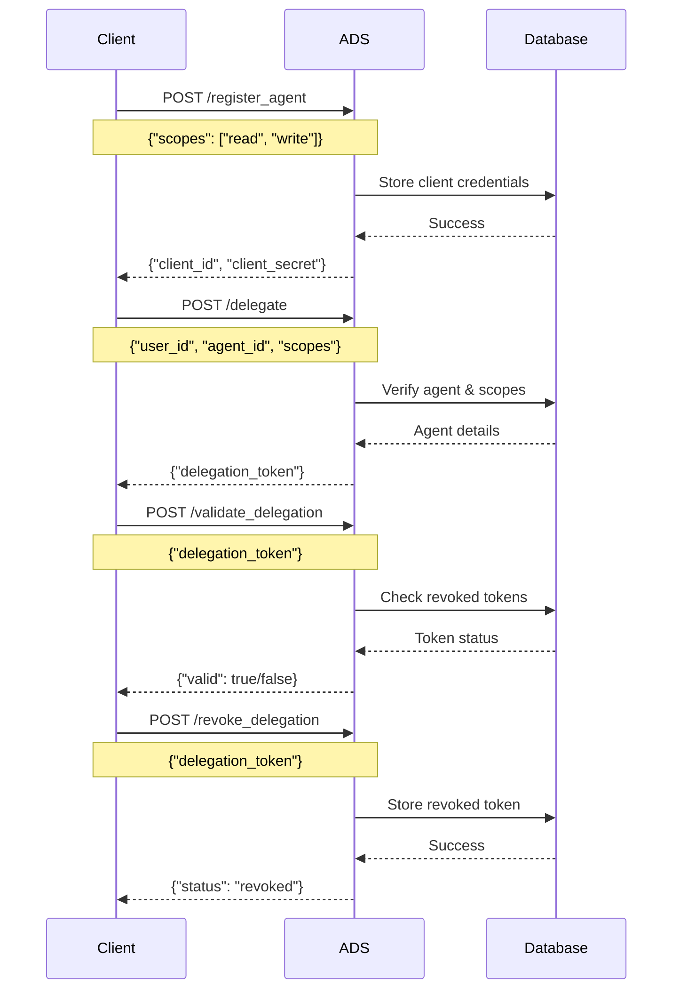

# Authentication and Delegation Service (ADS)

A Flask-based service for managing AI agent authentication and delegation tokens.

## Overview

The Authentication and Delegation Service (ADS) provides a secure way to:
- Register AI agents
- Issue delegation tokens
- Validate tokens
- Revoke tokens
- Handle token expiration

## Sequence Diagram



## API Endpoints

### 1. Register Agent
- **Endpoint**: `/register_agent`
- **Method**: POST
- **Body**: `{"scopes": ["read", "write"]}`
- **Response**: `{"client_id": "...", "client_secret": "..."}`

### 2. Delegate Token
- **Endpoint**: `/delegate`
- **Method**: POST
- **Body**: `{"user_id": "...", "agent_id": "...", "scopes": [...]}`
- **Response**: `{"delegation_token": "..."}`

### 3. Validate Token
- **Endpoint**: `/validate_delegation`
- **Method**: POST
- **Body**: `{"delegation_token": "..."}`
- **Response**: `{"valid": true/false, "user_id": "...", "agent_id": "...", "scopes": [...]}`

### 4. Revoke Token
- **Endpoint**: `/revoke_delegation`
- **Method**: POST
- **Body**: `{"delegation_token": "..."}`
- **Response**: `{"status": "revoked"}`

## Setup and Installation

1. Install dependencies:
```bash
pip install -r requirements.txt
```

2. Run the server:
```bash
python ADS.py
```

The server will start on http://127.0.0.1:5001

## Security Features

- JWT-based token system
- Token expiration
- Token revocation
- Scope-based access control
- SQLite database for persistent storage
- Debug logging for monitoring

## Testing

Run the test suite:
```bash
python -m unittest test_ads.py -v
```

## Development

The service is built with:
- Flask 2.0.1
- PyJWT for token handling
- SQLite for data storage
- Werkzeug for development server

## Notes

- The service runs in debug mode for development
- HTTPS enforcement is commented out for testing
- Default token expiration is 1 hour
- Debug PIN: 140-553-687 (for development server) 